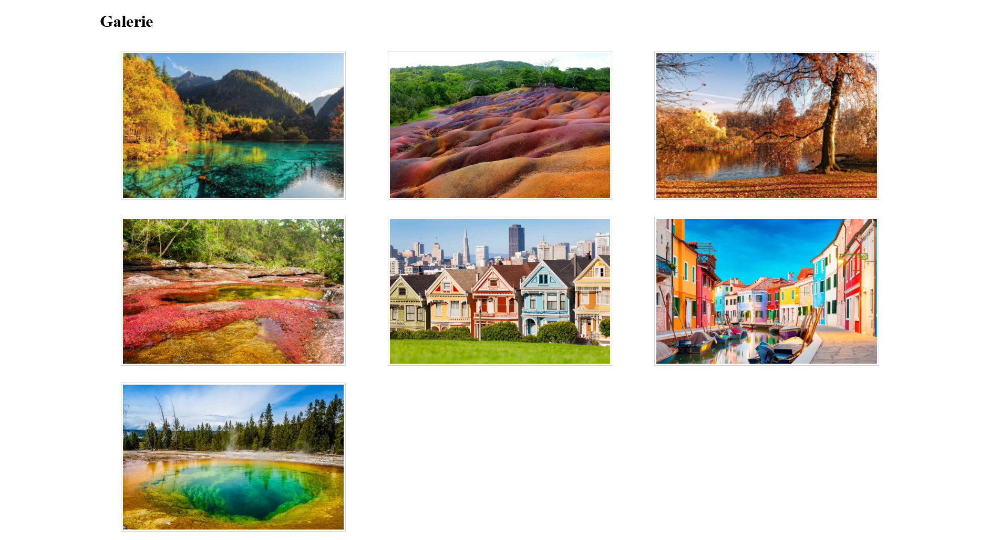
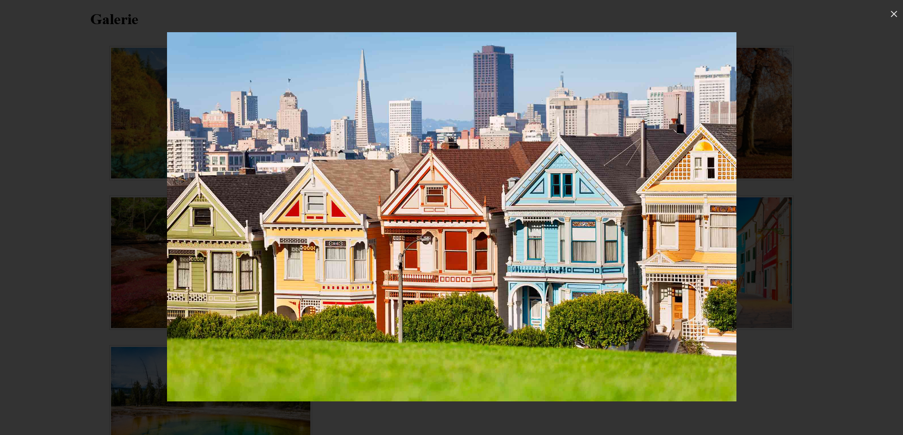

# LightBox

## Objectif
Vous devez réaliser une galerie d'images avec zoom sur l'image au clic comme indiqué dans les captures ci-dessous.

## Résultat

Stocker l'ensemble de vos codes soit sur un dépôt GIT ou sur CodePen au choix.
